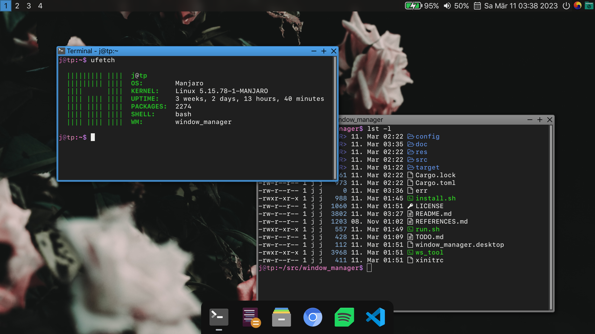

# window_manager



### floating window manager for X

## Some features

- Floating windows

- Snapping to [Top-/Bottom-] Left/Right, or Maximized

- Fullscreen windows

- Center windows

- Focus/Move/Resize using mouse

- Focus using Windows-style Alt+Tab

- Workspaces/Virtual Desktops

- Fake [Hibernation](#hibernation)

## Dependencies

Written in rust, `cargo` required.

Libraries:

- `X11`

- `Xft`

- `XRes`

## Compiling

### Debug

```sh
$ cargo build
$ ./run.sh
```

This launches the X server and runs the window manager locally so it has to be ran from a tty.

### Release

```
$ cargo build --realse
$ ./install.sh
```

This installs the windows manager onto the system, it can now be ran from a `.xinitrc` using:

```sh
exec window_manager
```

Or for a display manager like `GDM`, `SDDM`, `LightDM`, add this to `/usr/share/xsessions/window_manager.desktop`:

```desktop
[Desktop Entry]
Name=window_manager
Comment=Session running window_manager
Exec=window_manager
Type=Application
```

(the `install.sh` script will ask you if want to create this file).

### Installation script

Running `install.sh` will:

- compile the program if `target/realease/window_manager` does not exist

- copy the program to `$INSTALL_PREFIX/window_manager` (default for `INSTALL_PREFIX` is `/usr/local/bin`)

- For each of these files, asks if you want to copy them to the corresponding location:
  - `config` -> `$CONFIG_PREFIX/window_manager/config`
  - `autostartrc` -> `$CONFIG_PREFIX/window_manager/autostratrc` (You probably want your own file instead of the example)
  - `window_manager.desktop` -> `/usr/share/xsessions/window_manager.desktop`

  (default for `CONFIG_PREFIX` is `$XDG_CONFIG_HOME` or `$HOME/.config`)

## Configuration

The window manager is configured using the `config` file in `$XDG_CONFIG_HOME/window_manager` or `$HOME/.config/window_manager`.

See [configuration file format](./doc/CONFIG.md).

Applications that should run at startup are added to `autostartrc` in the same directory.

This is simply a bash script that is run on startup (so don't forget to add `&` to the end of command so they don't block execution).

### Pre-defined keys

- `Mod + Left Mouse Click` Focus the clicked window

- `Mod + Left Mouse Hold` Move the clicked window

- `Mod + Shift + Left Mouse Hold` Move the clicked window and snap it based on the resulting position
  - Left half:
    - Top/Bottom quarter: Snap to Top-/Bottom- Left
    - Otherwise: Snap to Left
  - Right half works the same way

- `Mod + Right Mouse Hold` Resize the clicked window

- `Alt + Tab` Windows-style window switching

## Hibernation

(This was mostly implemented for fun and is likely not something you want).

This stores the position and workspace of each window as well as the command used to launch the program that owns the window (by PID).

On startup it then runs all these processes and moves their window to the correct workspace and position, preserving the stacking order.

This does not restore the state of the program in any way beyond running it with the same command line (hence the *fake*).

This also does not work if one process owns multiple windows.

## ws_tool

A basic python script that lets you interact with workspaces

```sh
$ ./ws_tool get
> Number of wkrspaces: 4
> Current workspace:   1

$ ./ws_tool set 2
> Switched to workspace 2

$ ./ws_tool format inactive active join
# (assuming 4 workspaces, 2 is active)
> inactive join active join inactive join inactive
```

See the [Polybar](#polybar) section for an example usage of the `format` command.

## Polybar

Make polybar a meta-window:
```
wm-name = window_manager_bar
```
(`window_manager_bar` is always defined to be a meta-window).


Example for a polybar module that displays the active workspace and lets you switch workspace by scrolling/clicking on the module using the `ws_tool` script.
(uses the `circle` and `dot-circle` characters from [Font Awesome Free Regular](https://fontawesome.com/docs/desktop/setup/get-started))

```
[module/window_manager]
  type = custom/script
  exec = ws_tool format '' ''
  interval = 1
  scroll-up = ws_tool set prev
  scroll-down = ws_tool set next
  click-left = ws_tool set next
  click-right = ws_tool set prev
```

### Acknowledgments

- [qpwm](https://github.com/ssleert/qpwm/)
- [dwm](https://dwm.suckless.org/)
- [tinywm](https://github.com/mackstann/tinywm)
- [How X Window Managers Work, And How To Write One](https://jichu4n.com/posts/how-x-window-managers-work-and-how-to-write-one-part-i/)

